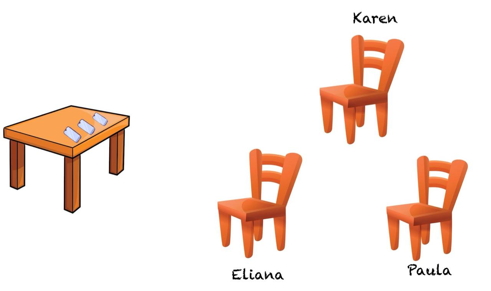

<h1 align="center">AISLAMIENTO DE VOZ ESPECIFICA EN AUDIO MIXTO</h1>

<p align="center"> Problema:  Fiesta de cóctel</p>
<br />
<div align="center">
 
</div>

<br />
En un evento tipo coctel, se instalaron varios micrófonos para escuchar lo que
las personas estaban hablando; una vez terminó la fiesta, se solicitó a los
ingenieros que entregaran el audio de la voz de uno de los participantes.
Los ingenieros analizaron las señales grabadas por los micrófonos eran mezclas
de señales que provenían de diferentes fuentes (personas) para todos los casos
y se encontraron con el problema de aislar la voz de interés.


## Tabla de contenidos:
---

- [OBJETIVO](#objetivo)
- [MONTAJE](#montaje)
- [PROCESAMIENTO DE LAS SEÑALES](#procesamiento)
- [Guía de instalación](#guía-de-instalación)
- [Cómo contribuir](#cómo-contribuir)
- [Código de conducta](#código-de-conducta)
- [Autor/es](#autores)
- [Información adicional](#información-adicional)
- [Licencia](#licencia)
- [Limitación de responsabilidades - Solo BID](#limitación-de-responsabilidades)

## Objetivo
---
En este trabajo, se propuso abordar el desafiante problema de la 'fiesta de cóctel'. Simulando un escenario real, se configuró un arreglo de múltiples micrófonos para capturar simultáneamente las señales de varias fuentes sonoras. Al igual que en una reunión social, las grabaciones resultantes fueron una mezcla compleja de voces superpuestas, representando el típico desafío de aislar una señal de interés en un entorno acústicamente ruidoso. El objetivo principal fue desarrollar y evaluar técnicas de procesamiento de señales para abordar este problema, explorando algoritmos de separación de fuentes que permitieran aislar la voz de una persona específica a partir de una mezcla de múltiples hablantes. A través de este experimento, se buscó comprender los desafíos inherentes a la separación de fuentes y evaluar la eficacia de diferentes enfoques para resolver el problema de la 'fiesta de cóctel'.


## Montaje
---
Se implementó un montaje en el que se utilizaron tres micrófonos con una frecuencia de muestreo de 44 kHz, asegurada por la aplicación RecForge II. Las tres personas encargadas de emitir las voces se ubicaron en sillas a diferentes distancias respecto a los micrófonos, que estuvieron colocados en el mismo punto. Como primer paso, se realizó una grabación del ruido ambiente, que fue mínimo gracias a que el experimento se llevó a cabo en un cuarto insonorizado, cuyo objetivo es minimizar la reflexión del sonido. Después, cada persona recitó un trabalenguas, el cual fue captado por los micrófonos. Estos audios se guardaron y usaron como archivos .wav. 

<br />
<div align="center">
 
</div>


## Procesamiento
---
### Paso 1: Leer las señales de audio
```
import soundfile as sn

...

pim, Fs1 = sn.read('AUDIO_1.wav')
pum, Fs2 = sn.read('AUDIO_2.wav')
pam, Fs3 = sn.read('AUDIO_3.wav')
pim1, Fr1 = sn.read('RUIDO_1.wav')
pum2, Fr2 = sn.read('RUIDO_2.wav')
pam3, Fr3 = sn.read('RUIDO_3.wav')
```
### Paso 2: Mezclar las señales, para poder utilizar ICA (Análisis de componentes independientes)

```
audio_mezclado = pim_recortado + pum_recortado + pam_recortado
```

### Paso 3: Aplicar el ICA

```
ica = FastICA(n_components=3)
sources = ica.fit_transform(audio_mezclado.reshape(-1, 1))
```
### Paso 4: Seleccionar la fuente (voz) que se desea filtrar

```
voz_filtrada = sources[:, 0]
```

### Paso 5: Aplicar filtro pasabanda para mejorar la señal 

```
def butter_bandpass(lowcut, highcut, fs, order=5):
    nyquist = 0.5 * fs
    low = lowcut / nyquist
    high = highcut / nyquist
    b, a = butter(order, [low, high], btype='band')
    return b, a

def bandpass_filter(data, lowcut, highcut, fs, order=5):
    b, a = butter_bandpass(lowcut, highcut, fs, order=order)
    y = lfilter(b, a, data)
    return y

lowcut = 1500.0  # Frecuencia mínima en Hz
highcut = 3000.0  # Frecuencia máxima en Hz

voz_filtrada_mejorada = bandpass_filter(voz_filtrada_recortada, lowcut, highcut, Fs1)

voz_filtrada_mejorada /= np.max(np.abs(voz_filtrada_mejorada))

sn.write('Vocecita.wav', voz_filtrada_mejorada, Fs1)
```

### Paso 6: Calcular SNR 

```
def calcular_snr(signal, noise):
    # Calcular la potencia de la señal
    potencia_signal = np.mean(signal**2)
    # Calcular la potencia del ruido
    potencia_noise = np.mean(noise**2)
    # Evitar división por cero
    if potencia_noise == 0:
        potencia_noise = np.finfo(float).eps
    # Calcular SNR en decibelios
    snr_db = 10 * np.log10(potencia_signal / potencia_noise)
    return snr_db

snr_pim = calcular_snr(pim, pim1)
snr_pum = calcular_snr(pum, pum2)
snr_pam = calcular_snr(pam, pam3)

snr_pim1 = calcular_snr(voz_filtrada_mejorada, pim1)
snr_pum2 = calcular_snr(voz_filtrada_mejorada, pum2)
snr_pam3 = calcular_snr(voz_filtrada_mejorada, pam3)
```

### Paso 7: Análisis temporal

```
timepim = np.arange(0, len(pim)) / Fs1
timepum = np.arange(0, len(pum)) / Fs2
timepam= np.arange(0, len(pam)) / Fs3

timepim1 = np.arange(0, len(pim1)) / Fr1
timepum2 = np.arange(0, len(pum2)) / Fr2
timepam3 = np.arange(0, len(pam3)) / Fr3

plt.figure(figsize=(10, 6))

plt.plot(timepim, pim, label='Voces Toma 1', color='pink')
plt.plot(timepum, pum, label='Voces Toma 2', color='red')
plt.plot(timepam, pam, label='Voces Toma 3', color='green')

plt.plot(timepim1, pim1, label='Ruido Toma 1', color='blue')
plt.plot(timepum2, pum2, label='Ruido Toma 2', color='brown')
plt.plot(timepam3, pam3, label='Ruido Toma 3', color='white')

plt.title("Análisis Temporal de Todas las Señales")
plt.xlabel("Tiempo [s]")
plt.ylabel("Amplitud [mV]")
plt.legend()
plt.show()
```
La gráfica presentada es la siguiente: 


### Paso 8: Análisis espectral

```
N1 = len(timepim)
T1 = 1.0 / Fs1

N2 = len(timepum)
T2 = 1.0 / Fs2

N3 = len(timepam)
T3 = 1.0 / Fs3

Nr1 = len(timepim1)
Tr1 = 1.0 / Fr1

Nr2 = len(timepum2)
Tr2 = 1.0 / Fr2

Nr3 = len(timepam3)
Tr3 = 1.0 / Fr3

yf_pim= fft(pim)
yf_pum = fft(pum)
yf_pam = fft(pam)
yf_pim1 = fft(pim1)
yf_pum2 = fft(pum2)
yf_pam3 = fft(pam3)

xf_pim = fftfreq(N1, T1)[:N1//2]
xf_pum = fftfreq(N2, T2)[:N2//2]
xf_pam = fftfreq(N3, T3)[:N3//2]
xf_pim1 = fftfreq(Nr1, Tr1)[:Nr1//2]
xf_pum2 = fftfreq(Nr2, Tr2)[:Nr2//2]
xf_pam3 = fftfreq(Nr3, Tr3)[:Nr3//2]

plt.figure(figsize=(10, 6))

plt.plot(xf_pim, 2.0/N1 * np.abs(yf_pim[:N1//2]), label='Voces Toma 1', color='blue')
plt.plot(xf_pum, 2.0/N2 * np.abs(yf_pum[:N2//2]), label='Voces Toma 2', color='green')
plt.plot(xf_pam, 2.0/N3 * np.abs(yf_pam[:N3//2]), label='Voces Toma 3', color='red')

plt.plot(xf_pim1, 2.0/Nr1 * np.abs(yf_pim1[:Nr1//2]), label='Ruido Toma 1', color='orange')
plt.plot(xf_pum2, 2.0/Nr2 * np.abs(yf_pum2[:Nr2//2]), label='Ruido Toma 2', color='yellow')
plt.plot(xf_pam3, 2.0/Nr3 * np.abs(yf_pam3[:Nr3//2]), label='Ruido Toma 3', color='purple')

plt.title("Análisis Espectral usando FFT de Todas las Señales")
plt.xlabel("Frecuencia [Hz]")
plt.ylabel("Amplitud [dB]")
plt.legend()
plt.show()
```
La gráfica realizada es la siguiente: 

### Paso 7: Visualización de la voz filtrada

```
plt.figure(figsize=(12, 6))
plt.plot(voz_filtrada_mejorada, color='violet')
plt.legend()
plt.title("Voz Filtrada usando ICA & Filtro Pasa Banda")
```

La gráfica de la voz filtrada es la siguiente: 


 	
## Guía de instalación
---
Paso a paso de cómo instalar la herramienta digital. En esta sección es recomendable explicar la arquitectura de carpetas y módulos que componen el sistema.

Según el tipo de herramienta digital, el nivel de complejidad puede variar. En algunas ocasiones puede ser necesario instalar componentes que tienen dependencia con la herramienta digital. Si este es el caso, añade también la siguiente sección.

La guía de instalación debe contener de manera específica:
- Los requisitos del sistema operativo para la compilación (versiones específicas de librerías, software de gestión de paquetes y dependencias, SDKs y compiladores, etc.).
- Las dependencias propias del proyecto, tanto externas como internas (orden de compilación de sub-módulos, configuración de ubicación de librerías dinámicas, etc.).
- Pasos específicos para la compilación del código fuente y ejecución de tests unitarios en caso de que el proyecto disponga de ellos.

### Dependencias
Descripción de los recursos externos que generan una dependencia para la reutilización de la herramienta digital (librerías, frameworks, acceso a bases de datos y licencias de cada recurso). Es una buena práctica describir las últimas versiones en las que ha sido probada la herramienta digital. 

    Puedes usar este estilo de letra diferenciar los comandos de instalación.

## Cómo contribuir
---
Esta sección explica a desarrolladores cuáles son las maneras habituales de enviar una solicitud de adhesión de nuevo código (“pull requests”), cómo declarar fallos en la herramienta y qué guías de estilo se deben usar al escribir más líneas de código. También puedes hacer un listado de puntos que se pueden mejorar de tu código para crear ideas de mejora.

## Código de conducta 
---
El código de conducta establece las normas sociales, reglas y responsabilidades que los individuos y organizaciones deben seguir al interactuar de alguna manera con la herramienta digital o su comunidad. Es una buena práctica para crear un ambiente de respeto e inclusión en las contribuciones al proyecto. 

La plataforma Github premia y ayuda a los repositorios dispongan de este archivo. Al crear CODE_OF_CONDUCT.md puedes empezar desde una plantilla sugerida por ellos. Puedes leer más sobre cómo crear un archivo de Código de Conducta (aquí)[https://help.github.com/articles/adding-a-code-of-conduct-to-your-project/]

## Autor/es
---
Nombra a el/los autor/es original/es. Consulta con ellos antes de publicar un email o un nombre personal. Una manera muy común es dirigirlos a sus cuentas de redes sociales.

## Información adicional
---
Esta es la sección que permite agregar más información de contexto al proyecto como alguna web de relevancia, proyectos similares o que hayan usado la misma tecnología.

## Licencia 
---

La licencia especifica los permisos y las condiciones de uso que el desarrollador otorga a otros desarrolladores que usen y/o modifiquen la herramienta digital.

Incluye en esta sección una nota con el tipo de licencia otorgado a esta herramienta digital. El texto de la licencia debe estar incluído en un archivo *LICENSE.md* o *LICENSE.txt* en la raíz del repositorio.

Si desconoces qué tipos de licencias existen y cuál es la mejor para cada caso, te recomendamos visitar la página https://choosealicense.com/.

Si la herramienta que estás publicando con la iniciativa Código para el Desarrollo ha sido financiada por el BID, te invitamos a revisar la [licencia oficial del banco para publicar software](https://github.com/EL-BID/Plantilla-de-repositorio/blob/master/LICENSE.md)

## Limitación de responsabilidades
Disclaimer: Esta sección es solo para herramientas financiadas por el BID.

El BID no será responsable, bajo circunstancia alguna, de daño ni indemnización, moral o patrimonial; directo o indirecto; accesorio o especial; o por vía de consecuencia, previsto o imprevisto, que pudiese surgir:

i. Bajo cualquier teoría de responsabilidad, ya sea por contrato, infracción de derechos de propiedad intelectual, negligencia o bajo cualquier otra teoría; y/o

ii. A raíz del uso de la Herramienta Digital, incluyendo, pero sin limitación de potenciales defectos en la Herramienta Digital, o la pérdida o inexactitud de los datos de cualquier tipo. Lo anterior incluye los gastos o daños asociados a fallas de comunicación y/o fallas de funcionamiento de computadoras, vinculados con la utilización de la Herramienta Digital.
