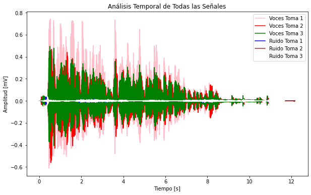
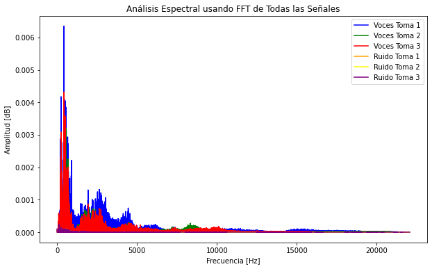
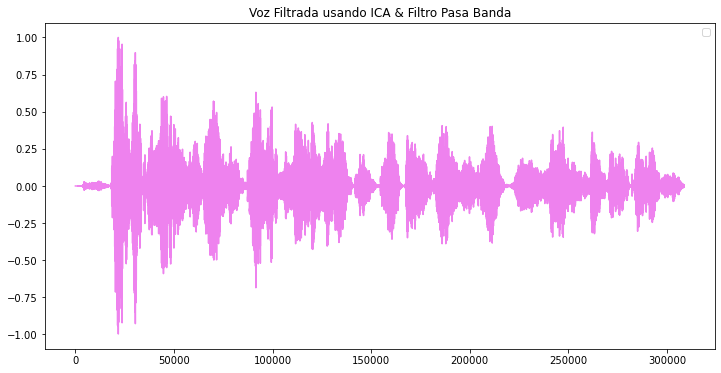

-*
<h1 align="center">AISLAMIENTO DE VOZ ESPECIFICA EN AUDIO MIXTO</h1>

<p align="center"> Problema:  Fiesta de cóctel</p>
<br />
<div align="center">
 
</div>

<br />
En un evento tipo coctel, se instalaron varios micrófonos para escuchar lo que
las personas estaban hablando; una vez terminó la fiesta, se solicitó a los
ingenieros que entregaran el audio de la voz de uno de los participantes.
Los ingenieros analizaron las señales grabadas por los micrófonos eran mezclas
de señales que provenían de diferentes fuentes (personas) para todos los casos
y se encontraron con el problema de aislar la voz de interés.


## Tabla de contenidos:
---

- [OBJETIVO](#objetivo)
- [MONTAJE](#montaje)
- [PROCESAMIENTO DE LAS SEÑALES](#procesamiento)
- [ANÁLISIS DE RESULTADOS](#resultados)
- [APLICACIONES EN BIOMÉDICA](#aplicaciones)


## Objetivo
---
En este trabajo, se propuso abordar el desafiante problema de la 'fiesta de cóctel'. Simulando un escenario real, se configuró un arreglo de múltiples micrófonos para capturar simultáneamente las señales de varias fuentes sonoras. Al igual que en una reunión social, las grabaciones resultantes fueron una mezcla compleja de voces superpuestas, representando el típico desafío de aislar una señal de interés en un entorno acústicamente ruidoso. El objetivo principal fue desarrollar y evaluar técnicas de procesamiento de señales para abordar este problema, explorando algoritmos de separación de fuentes que permitieran aislar la voz de una persona específica a partir de una mezcla de múltiples hablantes. A través de este experimento, se buscó comprender los desafíos inherentes a la separación de fuentes y evaluar la eficacia de diferentes enfoques para resolver el problema de la 'fiesta de cóctel'.


## Montaje
---
Se implementó un montaje en el que se utilizaron tres micrófonos con una frecuencia de muestreo de 44 kHz, asegurada por la aplicación RecForge II. Las tres personas encargadas de emitir las voces se ubicaron en sillas a diferentes distancias respecto a los micrófonos, que estuvieron colocados en el mismo punto. Como primer paso, se realizó una grabación del ruido ambiente, que fue mínimo gracias a que el experimento se llevó a cabo en un cuarto insonorizado, cuyo objetivo es minimizar la reflexión del sonido. Después, cada persona recitó un trabalenguas, el cual fue captado por los micrófonos. Estos audios se guardaron y usaron como archivos .wav. 

<br />
<div align="center">
 
</div>


## Procesamiento
---
### Paso 1: Leer las señales de audio
```
import soundfile as sn

...

pim, Fs1 = sn.read('AUDIO_1.wav')
pum, Fs2 = sn.read('AUDIO_2.wav')
pam, Fs3 = sn.read('AUDIO_3.wav')
pim1, Fr1 = sn.read('RUIDO_1.wav')
pum2, Fr2 = sn.read('RUIDO_2.wav')
pam3, Fr3 = sn.read('RUIDO_3.wav')
```
### Paso 2: Mezclar las señales, para poder utilizar ICA (Análisis de componentes independientes)

```
audio_mezclado = pim_recortado + pum_recortado + pam_recortado
```

### Paso 3: Aplicar el ICA

```
ica = FastICA(n_components=3)
sources = ica.fit_transform(audio_mezclado.reshape(-1, 1))
```
### Paso 4: Seleccionar la fuente (voz) que se desea filtrar

```
voz_filtrada = sources[:, 0]
```

### Paso 5: Aplicar filtro pasabanda para mejorar la señal 

```
def butter_bandpass(lowcut, highcut, fs, order=5):
    nyquist = 0.5 * fs
    low = lowcut / nyquist
    high = highcut / nyquist
    b, a = butter(order, [low, high], btype='band')
    return b, a

def bandpass_filter(data, lowcut, highcut, fs, order=5):
    b, a = butter_bandpass(lowcut, highcut, fs, order=order)
    y = lfilter(b, a, data)
    return y

lowcut = 1500.0  # Frecuencia mínima en Hz
highcut = 3000.0  # Frecuencia máxima en Hz

voz_filtrada_mejorada = bandpass_filter(voz_filtrada_recortada, lowcut, highcut, Fs1)

voz_filtrada_mejorada /= np.max(np.abs(voz_filtrada_mejorada))

sn.write('Vocecita.wav', voz_filtrada_mejorada, Fs1)
```

### Paso 6: Calcular SNR 

```
def calcular_snr(signal, noise):
    # Calcular la potencia de la señal
    potencia_signal = np.mean(signal**2)
    # Calcular la potencia del ruido
    potencia_noise = np.mean(noise**2)
    # Evitar división por cero
    if potencia_noise == 0:
        potencia_noise = np.finfo(float).eps
    # Calcular SNR en decibelios
    snr_db = 10 * np.log10(potencia_signal / potencia_noise)
    return snr_db

snr_pim = calcular_snr(pim, pim1)
snr_pum = calcular_snr(pum, pum2)
snr_pam = calcular_snr(pam, pam3)

snr_pim1 = calcular_snr(voz_filtrada_mejorada, pim1)
snr_pum2 = calcular_snr(voz_filtrada_mejorada, pum2)
snr_pam3 = calcular_snr(voz_filtrada_mejorada, pam3)
```

### Paso 7: Análisis temporal

```
timepim = np.arange(0, len(pim)) / Fs1
timepum = np.arange(0, len(pum)) / Fs2
timepam= np.arange(0, len(pam)) / Fs3

timepim1 = np.arange(0, len(pim1)) / Fr1
timepum2 = np.arange(0, len(pum2)) / Fr2
timepam3 = np.arange(0, len(pam3)) / Fr3

plt.figure(figsize=(10, 6))

plt.plot(timepim, pim, label='Voces Toma 1', color='pink')
plt.plot(timepum, pum, label='Voces Toma 2', color='red')
plt.plot(timepam, pam, label='Voces Toma 3', color='green')

plt.plot(timepim1, pim1, label='Ruido Toma 1', color='blue')
plt.plot(timepum2, pum2, label='Ruido Toma 2', color='brown')
plt.plot(timepam3, pam3, label='Ruido Toma 3', color='white')

plt.title("Análisis Temporal de Todas las Señales")
plt.xlabel("Tiempo [s]")
plt.ylabel("Amplitud [mV]")
plt.legend()
plt.show()
```
La gráfica presentada es la siguiente: 

<br />
<div align="center">
 
</div>


### Paso 8: Análisis espectral

```
N1 = len(timepim)
T1 = 1.0 / Fs1

N2 = len(timepum)
T2 = 1.0 / Fs2

N3 = len(timepam)
T3 = 1.0 / Fs3

Nr1 = len(timepim1)
Tr1 = 1.0 / Fr1

Nr2 = len(timepum2)
Tr2 = 1.0 / Fr2

Nr3 = len(timepam3)
Tr3 = 1.0 / Fr3

yf_pim= fft(pim)
yf_pum = fft(pum)
yf_pam = fft(pam)
yf_pim1 = fft(pim1)
yf_pum2 = fft(pum2)
yf_pam3 = fft(pam3)

xf_pim = fftfreq(N1, T1)[:N1//2]
xf_pum = fftfreq(N2, T2)[:N2//2]
xf_pam = fftfreq(N3, T3)[:N3//2]
xf_pim1 = fftfreq(Nr1, Tr1)[:Nr1//2]
xf_pum2 = fftfreq(Nr2, Tr2)[:Nr2//2]
xf_pam3 = fftfreq(Nr3, Tr3)[:Nr3//2]

plt.figure(figsize=(10, 6))

plt.plot(xf_pim, 2.0/N1 * np.abs(yf_pim[:N1//2]), label='Voces Toma 1', color='blue')
plt.plot(xf_pum, 2.0/N2 * np.abs(yf_pum[:N2//2]), label='Voces Toma 2', color='green')
plt.plot(xf_pam, 2.0/N3 * np.abs(yf_pam[:N3//2]), label='Voces Toma 3', color='red')

plt.plot(xf_pim1, 2.0/Nr1 * np.abs(yf_pim1[:Nr1//2]), label='Ruido Toma 1', color='orange')
plt.plot(xf_pum2, 2.0/Nr2 * np.abs(yf_pum2[:Nr2//2]), label='Ruido Toma 2', color='yellow')
plt.plot(xf_pam3, 2.0/Nr3 * np.abs(yf_pam3[:Nr3//2]), label='Ruido Toma 3', color='purple')

plt.title("Análisis Espectral usando FFT de Todas las Señales")
plt.xlabel("Frecuencia [Hz]")
plt.ylabel("Amplitud [dB]")
plt.legend()
plt.show()
```
La gráfica realizada es la siguiente: 

<br />
<div align="center">
 
</div>

### Paso 7: Visualización de la voz filtrada

```
plt.figure(figsize=(12, 6))
plt.plot(voz_filtrada_mejorada, color='violet')
plt.legend()
plt.title("Voz Filtrada usando ICA & Filtro Pasa Banda")
```

La gráfica de la voz filtrada es la siguiente: 

<br />
<div align="center">
 
</div>


 	
## Resultados
---

> SNR

Al momento de realizar el cálculo de las señales con sus respectivos ruidos, los resultados obtenidos fueron los siguientes: 

```
El SNR entre la señal de audio 1 y el ruido 1 es: 32.80 dB
El SNR entre la señal de audio 2 y el ruido 2 es: 44.29 dB
El SNR entre la señal de audio 3 y el ruido 3 es: 27.14 dB
El SNR entre Vocecita y el ruido 1 es: 33.48 dB
El SNR entre Vocecita y el ruido 2 es: 48.81 dB
El SNR entre Vocecita y el ruido 3 es: 31.89 dB
```
Siendo Vocecita la mezcla de las tres señales adquiridas. 

El análisis de los valores de SNR revela que tanto el filtrado pasabanda como el Análisis de Componentes Independientes (ICA) han contribuido a mejorar sustancialmente la calidad de la señal de audio. El filtrado ha eliminado las frecuencias no deseadas, mientras que ICA ha permitido separar de manera efectiva las fuentes de audio mezcladas. La señal resultante presenta una relación señal-ruido significativamente mayor, lo que indica una reducción efectiva del ruido y una mayor claridad en la señal de voz. Así mismo, el aumento del SNR después del procesamiento indica que la señal de voz filtrada es menos susceptible a interferencias y, por lo tanto, más adecuada para aplicaciones posteriores, como el reconocimiento de voz o la compresión de audio. Los resultados obtenidos demuestran la eficacia de las técnicas empleadas para mejorar la calidad de la señal.


> Análisis temporal y espectral

El análisis temporal de la señal indica la variación de la misma a lo largo del tiempo, entonces, permite identificar la presencia de ruido y la observación del patrón que siguen las voces, esto teniendo en cuenta que en todas las grabaciones, las personas están diciendo las mismas cosas. Por otro lado, en el análisis espectral se pueden identificar las frecuencias predominantes de la señal.

### Aplicaciones

La biomedicina ha experimentado una revolución gracias al avance de las tecnologías de procesamiento de señales. Al aplicar técnicas sofisticadas de filtrado y análisis a los datos biológicos, los investigadores y médicos pueden obtener una visión más profunda de las enfermedades y desarrollar tratamientos más efectivos. Desde la detección temprana del cáncer hasta la mejora de la calidad de vida de pacientes con enfermedades crónicas, estas herramientas están transformando la forma en que entendemos y tratamos las enfermedades.

